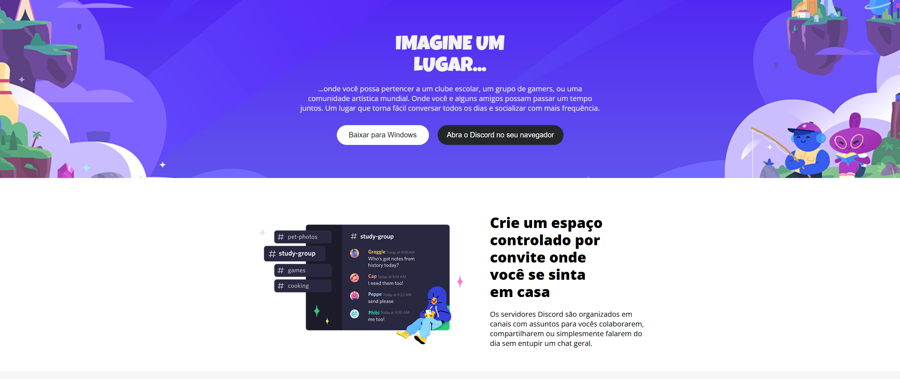
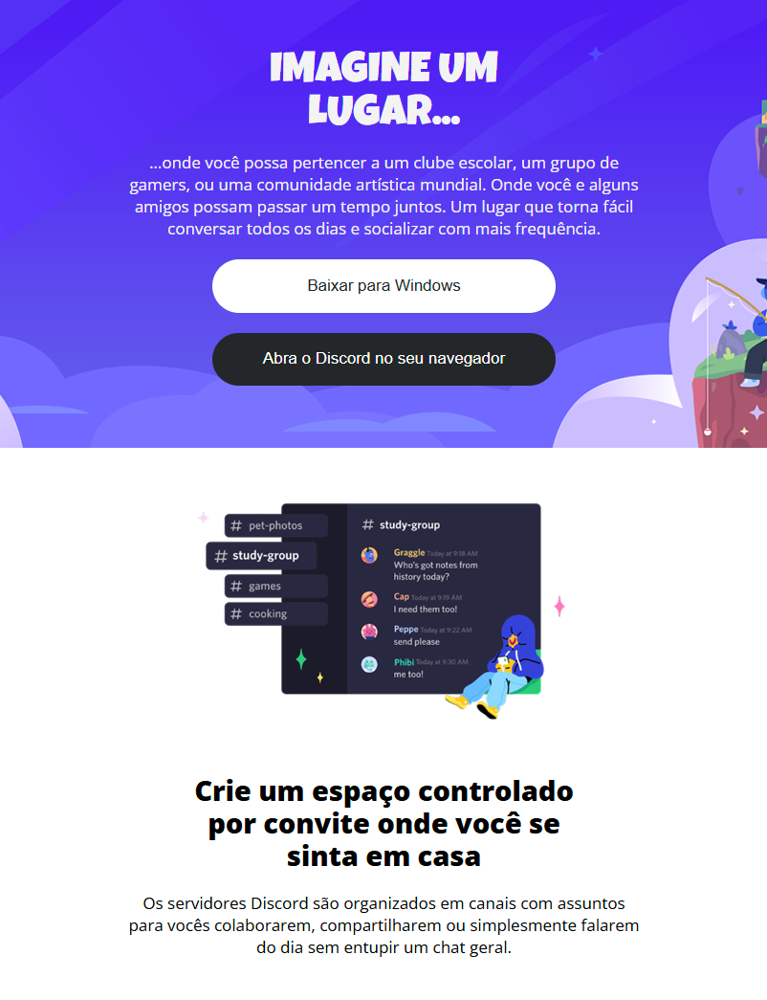
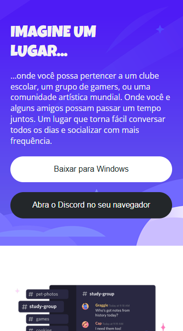

# Old Discord Website Recreation

## Description

This project is a recreation of the old Discord website using **HTML5** and **CSS3**. The main goal was to replicate the original layout and appearance, focusing on **responsiveness**.

The project was developed for learning purposes, emphasizing key web development concepts such as semantic structure, modern styling, and adaptation for multiple screen sizes.

## Technologies Used

- **HTML5**: Semantic structure and content of the website.
- **CSS3**: Visual styling, colors, typography, and effects.
- **Flexbox**: Organizing elements in flexible and efficient layouts.
- **Media Queries**: Making the website responsive for **mobile, tablet, laptop, and desktop** devices.

## Features and Learning Outcomes

- **Fully responsive layout**: Content adapts smoothly to **mobile, tablet, laptop, and desktop** screens.
- **Flexbox layout management**: Efficient alignment of menus, sections, and cards.
- **Advanced Media Queries**: Adjustments of fonts, spacing, image sizes, and positioning for different resolutions.
- **Faithful visual styling**: Colors, fonts, and effects closely match the original Discord design.
- **Semantic HTML practice**: Proper use of `<main>`, `<section>`, `<footer>`, among others.

## Screenshots

All preview images are located in `assets/images/preview`.

<strong>Desktop View</strong>

<strong>Tablet View</strong>

<strong>Mobile View</strong>

## Conclusion

This project was a great opportunity to strengthen knowledge in **HTML5**, **CSS3**, **Flexbox**, and **Media Queries**, while practicing the creation of **responsive and semantic layouts**. It is ideal for understanding how modern websites work and how to adapt them for multiple devices.

---

# Recriação do Antigo Site do Discord

## Descrição

Este projeto consiste na **recriação do antigo site do Discord** utilizando **HTML5** e **CSS3**. O objetivo principal foi replicar o layout e a aparência do site original, com foco em **responsividade** e boas práticas de desenvolvimento front-end.

O projeto foi desenvolvido com fins de estudo, reforçando conceitos essenciais de **web design**, incluindo estrutura semântica, estilização moderna e adaptação para diferentes tamanhos de tela.

## Tecnologias Utilizadas

- **HTML5**: Estrutura semântica e conteúdo do site.
- **CSS3**: Estilização visual, cores, tipografia e efeitos.
- **Flexbox**: Organização eficiente de elementos em layouts flexíveis.
- **Media Queries**: Tornar o site responsivo para **mobile, tablets, laptops e desktops**.

## Funcionalidades e Aprendizados

- **Layout totalmente responsivo**: Adaptação do conteúdo para **mobile, tablets, laptops e desktops**.
- **Organização com Flexbox**: Alinhamento eficiente de menus, seções e cards.
- **Media Queries avançadas**: Ajustes de fontes, espaçamentos, tamanhos de imagens e posicionamento para diferentes resoluções.
- **Estilização fiel ao design original**: Aplicação de cores, fontes e efeitos próximos ao site do Discord.
- **Prática de HTML semântico**: Uso correto de `<main>`, `<section>`, `<footer>`, entre outros.

## Screenshots

Todas as imagens de pré-visualização estão na pasta `assets/images/preview`.

<strong>Desktop View</strong>

<strong>Tablet View</strong>

<strong>Mobile View</strong>

## Considerações Finais

Este projeto foi uma excelente oportunidade para reforçar conhecimentos em **HTML5**, **CSS3**, **Flexbox** e **Media Queries**, além de praticar a criação de **layouts responsivos e semânticos**. Ideal para compreender o funcionamento de sites modernos e como adaptá-los para diferentes dispositivos.
